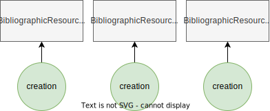
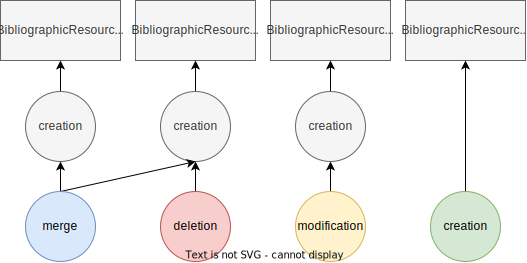
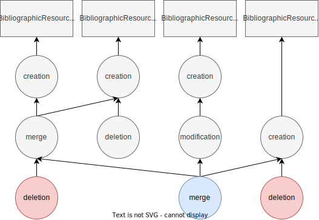

Growing provenance trees
========================

**Wellcome!** This tutorial shows how can the tree of provenance snapshots grow
in time according to the mechanism for generation of provenance implemented by
the `oc_ocdm` library.

For this purpose we're going to simulate a simple lifecycle for a few entities
of type ``BibliographicResource`` in which only the most common scenarios will
occur. Edge-cases such as the modification/merge/deletion of an entity for which
no provenance snapshot has ever been generated will be separately discussed at
the end.

.. note::
   You can find a Jupyter notebook with the code from this tutorial in the `GitHub
   repository <https://github.com/opencitations/oc_ocdm/blob/master/notebooks/growing_provenance_trees.ipynb>`_ .

Setup
-----
Firstly, we need to import the required modules:

.. code-block:: python
   :linenos:

   from oc_ocdm.graph import GraphSet
   from oc_ocdm.prov import ProvSet
   from rdflib import URIRef

Then, we need to initialize the ``GraphSet`` (which will contain our entities) and the
``ProvSet`` (which will contain the provenance snapshots):

.. code-block:: python
   :linenos:

   my_base_iri = "http://dataset_base_iri/"

   my_graphset = GraphSet(my_base_iri)
   my_provset = ProvSet(my_graphset, my_base_iri)

.. note::
   **For demonstration purpose only**, both sets are constructed without specifying the so-called
   ``info_dir`` (i.e. the folder in which to store the counters that are needed to generate the
   URIs of new entities). This means that, internally, a ``InMemoryCounterHandler`` instance is
   used: thus, all counters will be temporarily written in the system memory (instead of permanently
   stored in the filesystem).

Step 1
------
Let's start by creating three new ``BibliographicResource`` entities. To do so, we also need to
tell the library who's the agent that will be considered responsible for all the changes made
during this session (it must be a URI):

.. code-block:: python
   :linenos:

   # CREATION
   my_resp_agent = "http://responsible_agent_uri/"
   my_br_1 = my_graphset.add_br(my_resp_agent)
   my_br_2 = my_graphset.add_br(my_resp_agent)
   my_br_3 = my_graphset.add_br(my_resp_agent)

We now want to crystallize the current state of our dataset by generating a new set of provenance
snapshots:

.. code-block:: python
   :linenos:

   # PROVENANCE GENERATION
   my_provset.generate_provenance()

   # DATASET CLEANUP
   my_graphset.commit_changes()

.. note::
   The ``commit_changes`` method needs to be called after ``generate_provenance`` only when the user
   needs to perform further manipulations on the dataset. In fact, its purpose consists in committing all
   the changes applied up to now to each entity so that the library can internally reset its change-tracking
   algorithm, thus preparing itself for a new round of modifications.

Let's now review the newly generated provenance tree (all snapshots are stored inside the ``my_provset``
instance):

Step 2
------
In our example, the second round of manipulations consists of:

   #. the `creation` of yet another ``BibliographicResource``;
   #. the `modification` of the metadata associated to one of the entities;
   #. the `merge` between two entities.

.. code-block:: python
   :linenos:

   # CREATION
   my_resp_agent = "http://responsible_agent_uri/"
   my_br_4 = my_graphset.add_br(my_resp_agent)

   # MODIFICATION
   my_br_3.has_title("Demo")
   my_br_3.has_related_document(URIRef("http://related_document_1/"))
   my_br_3.has_related_document(URIRef("http://related_document_2/"))
   my_br_3.remove_related_document(URIRef("http://related_document_1/"))

   # MERGE (with implicit DELETION of my_br_2)
   my_br_1.merge(my_br_2)

We now ask again the library to generate the provenance snapshots required for describing
the latest changes:

.. code-block:: python
   :linenos:

   # PROVENANCE GENERATION
   my_provset.generate_provenance()

   # DATASET CLEANUP
   my_graphset.commit_changes()

This is the resulting provenance tree (snapshots generated during the previous step are greyed out):

Step 3
------
In the third (and last) step, we just merge all the remaining entities into one:

.. code-block:: python
   :linenos:

   # MERGE (with implicit DELETION of my_br_1 and my_br_4)
   my_br_3.merge(my_br_1)
   my_br_3.merge(my_br_4)

For the last time, we ask the library to automatically generate the provenance triples:

.. code-block:: python
   :linenos:

   # PROVENANCE GENERATION
   my_provset.generate_provenance()

The following image shows the final provenance tree (snapshots generated during the previous
steps are greyed out):

Edge-cases
----------
The ``generate_provenance`` implementation also considers various scenarios that may appear
less obvious to the reader with respect to the previously presented ones.

Scenario A:
***********
   * entity A is created;
   * entity A is merged with other entities;
   * ``generate_provenance`` is called.

In this case, since no `creation` snapshot was produced before the merge happened, as far
as the algorithm can tell entity A is completely new and this supersedes the fact that it was
also merged. A `creation` snapshot is generated.

Scenario B:
***********
   * entity A is created;
   * ``generate_provenance`` is called;
   * entities B\ :sub:`i`\  are created;
   * entity A is merged with entities B\ :sub:`i`\;
   * ``generate_provenance`` is called.

In this case, the `creation` snapshot of A was produced before the merge happened, hence the algorithm
doesn't need to produce it. Entities B\ :sub:`i`\, on the other hand, were not registered by provenance before
the merge: since the effect of such operation on them corresponds to a deletion, the algorithm is theoretically
required to register the deletion of non-existing entities.

What really happens in practice is that no snapshot is generated for entities B\ :sub:`i`\, which means that
it's not possible to generate a `merge` snapshot for A (since it would need to be linked to the snapshots of
entities B\ :sub:`i`\): thus, a simple `modification` snapshot is generated for A.

Scenario C:
***********
   * entity A is created;
   * entity A is deleted;
   * ``generate_provenance`` is called.

In this case, no `creation` snapshot was produced before the deletion happened, thus the algorithm is theoretically
required to register the deletion of an entity that wasn't even created. Since the net result of the two operations
effectively cancel out, no provenance snapshot needs to be produced.
